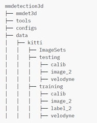

# Object-detection-lidar-and-image
## 一.环境安装
参考mmdetection3d官网, [安装教程](https://mmdetection3d.readthedocs.io/en/latest/getting_started.html#installation)
### 环境配置
####  1.	创建虚拟环境
    conda create -n open-mmlab python=3.7 -y

    conda activate open-mmlab
#### 2.	安装pytorch
Rtx2080ti下cuda10.2版本下:

    conda install pytorch==1.5.0 cudatoolkit=10.1 torchvision==0.6.0 -c pytorch
30系列显卡及其他需要查询pytorch官网
https://pytorch.org/
#### 3.	安装MMCV
    pip install mmcv-full -f https://download.openmmlab.com/mmcv/dist/{cu_version}/{torch_version}/index.html

其中{cu_version}以及{torch_version}为所安装的cuda版本以及torch版本
例如cuda10.2+pytorch1.5.0则为：
    pip install mmcv-full -f https://download.openmmlab.com/mmcv/dist/cu102/torch1.5.0/index.html
    
或者直接：
    
    pip install mmcv-full
#### 4.	安装MMDetection
    pip install mmdet==2.14.0

或者分步安装：

    git clone https://github.com/open-mmlab/mmdetection.git

    cd mmdetection

    git checkout v2.14.0  # switch to v2.14.0 branch

    pip install -r requirements/build.txt

    pip install -v -e .  # or "python setup.py develop"
#### 5.	安装MMSegmentation
    pip install mmsegmentation==0.14.1

或者直接从源码安装：

    git clone https://github.com/open-mmlab/mmsegmentation.git

    cd mmsegmentation

    git checkout v0.14.1  # switch to v0.14.1 branch

    pip install -e .  # or "python setup.py develop"
#### 6.	安装mmdetection3d
    git clone https://github.com/open-mmlab/mmdetection3d.git
    cd mmdetection3d
    pip install -v -e .  # or "python setup.py develop"
#### 以上具体版本要求可参考
(https://github.com/open-mmlab/mmdetection3d/blob/master/docs/en/getting_started.md)

### 数据准备
验证安装完成：
1.	KITTI数据集预处理

下载kitti数据集并解压且按照下列文件结构：

    mkdir ./data/kitti/ && mkdir ./data/kitti/ImageSets

下载数据划分文件

    wget -c  https://raw.githubusercontent.com/traveller59/second.pytorch/master/second/data/ImageSets/test.txt --no-check-certificate --content-disposition -O ./data/kitti/ImageSets/test.txt
    wget -c https://raw.githubusercontent.com/traveller59/second.pytorch/master/second/data/ImageSets/train.txt --no-check-certificate --content-disposition -O ./data/kitti/ImageSets/train.txt
    wget -c  https://raw.githubusercontent.com/traveller59/second.pytorch/master/second/data/ImageSets/val.txt --no-check-certificate --content-disposition -O ./data/kitti/ImageSets/val.txt
    wget -c  https://raw.githubusercontent.com/traveller59/second.pytorch/master/second/data/ImageSets/trainval.txt --no-check-certificate --content-disposition -O ./data/kitti/ImageSets/trainval.txt
    python tools/create_data.py kitti --root-path ./data/kitti --out-dir ./data/kitti --extra-tag kitti

### 训练测试
#### 训练：

    #单卡
    python tools/train.py ${CONFIG_FILE} [optional arguments]
    #多卡
    ./tools/dist_train.sh ${CONFIG_FILE} ${GPU_NUM} [optional arguments]
    
单卡：

    python tools/train.py configs/pointpillars/pointpillars_with_img.py

多卡：
    
    ./tools/dist_train.sh configs/pointpillars/pointpillars_with_img.py 8
    
 
#### 测试：

    # single-gpu testing
    python tools/test.py ${CONFIG_FILE} ${CHECKPOINT_FILE} [--out ${RESULT_FILE}] [--eval ${EVAL_METRICS}] [--show] [--show-dir ${SHOW_DIR}]

    # multi-gpu testing
    ./tools/dist_test.sh ${CONFIG_FILE} ${CHECKPOINT_FILE} ${GPU_NUM} [--out ${RESULT_FILE}] [--eval ${EVAL_METRICS}]

单卡：

    python tools/test.py configs/pointpillars/pointpillars_with_img.py checkpoints/epoch_160.pth --eval mAP --eval-options 'show=True' 'out_dir=./show_results'

多卡：
    
    ./tools/dist_test.sh configs/pointpillars/pointpillars_with_img.py checkpoints\epoch_160.pth 8 --eval mAP --eval-options 'show=True' 'out_dir=./show_results'
    
## 二.安装ros
参考ros官网，[ros melodic installation](http://wiki.ros.org/melodic/Installation/Ubuntu)
###  setup your sources.list

    sudo sh -c 'echo "deb http://packages.ros.org/ros/ubuntu $(lsb_release -sc) main" > /etc/apt/sources.list.d/ros-latest.list'

### Set up your keys
    sudo apt install curl # if you haven't already installed curl
    curl -s https://raw.githubusercontent.com/ros/rosdistro/master/ros.asc | sudo apt-key add -

### Installation
    sudo apt update
    sudo apt install ros-melodic-desktop-full
## 三.使用说明
### STEP 1.
激活所安装的mmdetection3d环境

    conda activate [环境名]

### STEP 2.

#### 1.
根据录制的bag包或者实时数据，获得传感器发出的topic名称

更改 src/mmdet3d/scripts/inference.py中333行和335行topic的名称(包括原始点云与图像的topic，发布的3d框topic)
#### 2.
将 inference.py 的39行 改为点云topic的 fram_id
#### 3.
更改

        src/tracker/scripts/test_main.py中 44行 frame_id 与上面一致

#### 4.
使用融合算法需要更改mmcv代码，具体位置在anaconda/envs/mmdetection3d环境名/lib/python3.7/site-packages/
mmdet/datasets/pipelines/loading.py
将文件夹中的edit_loading.py替换上面文件即可。

使用融合检测方法需要选择相应的函数，具体在inference.py 的356行，前提条件是获得图像与激光点云外参矩阵，外参矩阵修改的位置在src\mmdet3d\scripts\mmdet3d\apis\inference.py 的249行左右，内参是rect，外参是Trv2c
### STEP 3.
新建终端,启动ros:

    roscore
    
新建终端,运行:

    rosbag play [录制的bag包] 
    或者roslaunch [package] [topic]

再运行detection.sh与tracking.sh

    chmod +x detection.sh
    chmod +x tracking.sh
    ./detection.sh
    ./tracking.sh
### STEP 4.
rviz中更改frame为原始点云的frame，并add 

发布的3d框topic('/detection/lidar_detector/objectsbbox')

发布的track_id(track_id)

发布的点云和图像topic('/rslidar_points')('/usb_cam/image_raw')

## 四.遇到的问题及解决方法

### 1.`ImportError: libcudart.so.9.0: cannot open shared object file: No such file or directory`
解决方案：

cuda版本不对应

[解决方法链接](https://blog.csdn.net/slamdunkofkd/article/details/106976831)
### 2.`ModuleNotFoundError: No module named 'cStringIO'`

[解决方法链接](https://blog.csdn.net/weixin_44450684/article/details/92812746?utm_medium=distribute.pc_aggpage_search_result.none-task-blog-2~aggregatepage~first_rank_ecpm_v1~rank_v31_ecpm-1-92812746.pc_agg_new_rank&utm_term=python3+%E5%AE%89%E8%A3%85pypcd%E8%AF%BB%E5%8F%96pcd&spm=1000.2123.3001.4430)

### 3.`ModuleNotFoundError: No module named 'cython_bbox'`

[解决方法链接](https://blog.csdn.net/weixin_44773637/article/details/106017787)

### 4.`ubuntu安装cudnn,nvcc -V指令可用,/usr/local/下却没有`

[解决方法链接](https://blog.csdn.net/ai_faker/article/details/111687801)

## 五.接口说明
Object Detection ：
|   Node_name  | Subscribe |   Style   | Publish     | Style |
| :---        |    :----:   |   :----:| :----:  |     ---: |
| Detection      | /rslidar_points  | PointCloud2 | /detection/lidar_detector/objectsbbox & '/bbox_info'   |MarkerArray|
| Detection_with_img&lidar  |/rslidar_points & /usb_cam/image_raw      | PointCloud2&numpy_msg(Image) | /detection/lidar_detector/objectsbbox & '/bbox_info'      |MarkerArray|

Tracking ：
|   Node_name  | Subscribe |   Style   | Publish     | Style |
| :---        |    :----:   |   :----:| :----:  |     ---: |
| Tracking      | /bbox_info      | MarkerArray |/detection/lidar_detector/objects & track_id   |   MarkerArray  |

